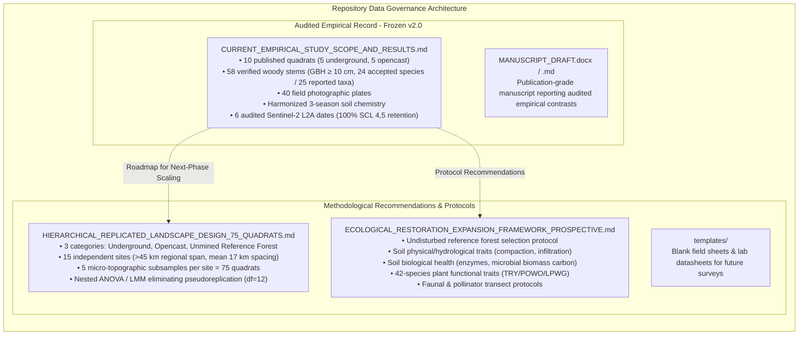

# Post-Mining Ecological Restoration & Phenological Dynamics in the Korba Coalfield

[](DATA_PROVENANCE.md)
[](https://sentinel.esa.int/)
[](HIERARCHICAL_REPLICATED_LANDSCAPE_DESIGN_75_QUADRATS.md)
[](CURRENT_EMPIRICAL_STUDY_SCOPE_AND_RESULTS.md)
[](LICENSE)

---

## Executive Summary & Ethical Data Governance

This repository contains the complete scientific and geospatial codebase for evaluating post-mining vegetation recovery, seasonal understory phenology, and landscape-scale ecological restoration across coal mining concessions in the **Korba Coalfield, Chhattisgarh, India** (*Sharma, Banerjee & Deb, 2026*).

### Strict Two-Document Empirical vs. Prospective Partition
To uphold the highest standards of scientific integrity and peer-review defensibility, the repository enforces a strict, transparent boundary between completed empirical data and prospective methodological architectures:



> [!IMPORTANT]
> **Ethical Boundary Guarantee:** No prospective additions (undisturbed reference forest measurements, infiltration rates, enzyme activities, or Linear Mixed-Effects Model $F$-statistics) are presented as completed empirical findings. All illustrative datasets are strictly quarantined with `Simulated_Example_` or `Proposed_Design_` prefixes and clearly designated as research blueprints.

---

## Master Document Directory & Cross-Reference Index

| Document / Asset | File Path | Status | Core Contents & Governance Role |
| :--- | :--- | :---: | :--- |
| **Current Empirical Scope & Results** | [`CURRENT_EMPIRICAL_STUDY_SCOPE_AND_RESULTS.md`](CURRENT_EMPIRICAL_STUDY_SCOPE_AND_RESULTS.md) | **Audited Empirical** | Master record of the 10 published quadrats ($n=5$ UG vs $n=5$ OC), 58 verified stems, soil chemistry, and 2024 Sentinel-2 phenology. |
| **Rebuttal to Editorial Assessment** | [`REBUTTAL_TO_EDITORIAL_ASSESSMENT.md`](REBUTTAL_TO_EDITORIAL_ASSESSMENT.md) | **Author Response** | Comprehensive point-by-point rebuttal to *Ecological Indicators* editorial assessment, addressing all 8 concerns and statistical requirements. |
| **Hierarchical Replicated Design (N=75)** | [`HIERARCHICAL_REPLICATED_LANDSCAPE_DESIGN_75_QUADRATS.md`](HIERARCHICAL_REPLICATED_LANDSCAPE_DESIGN_75_QUADRATS.md) | **Prospective Design** | Three-category, 15-site, 75-quadrat architecture eliminating pseudoreplication via nested ANOVA / LMM ($F$-test denominator $\text{df}=12$). |
| **Prospective Restoration Framework** | [`ECOLOGICAL_RESTORATION_EXPANSION_FRAMEWORK_PROSPECTIVE.md`](ECOLOGICAL_RESTORATION_EXPANSION_FRAMEWORK_PROSPECTIVE.md) | **Prospective Design** | Methodological framework for reference forest benchmarks, soil physical/biological functioning, functional traits, and faunal transects. |
| **Publication Manuscript (MS Word)** | [`MANUSCRIPT_DRAFT.docx`](MANUSCRIPT_DRAFT.docx) | **Publication Manuscript** | Submission-ready major revision manuscript (*Target: Ecological Indicators*), featuring evidence-constrained framing, Tables 1–6, Figures 1–6, and 6-section structure. |
| **Publication Manuscript (Markdown)** | [`MANUSCRIPT_DRAFT.md`](MANUSCRIPT_DRAFT.md) | **Publication Manuscript** | Complete markdown text with GitHub-flavored math, sequentially numbered Tables 1–6, Figures 1–6, and internal hyperlinks. |
| **Supplemental Material (MS Word)** | [`SUPPLEMENTAL_MATERIAL.docx`](SUPPLEMENTAL_MATERIAL.docx) | **Supplemental Deliverable** | Supplementary Tables S1–S8 and Figure S1 (observation provenance, woody inventory, photo register, regional leads, soil baseline, correlations, scale sensitivity). |
| **Supplemental Material (Markdown)** | [`SUPPLEMENTAL_MATERIAL.md`](SUPPLEMENTAL_MATERIAL.md) | **Supplemental Deliverable** | Full markdown version of supplementary materials, provenance records, and evidence registers. |
| **Botanical Field Audit Protocol** | [`BOTANICAL_FIELD_AUDIT_PROTOCOL.md`](BOTANICAL_FIELD_AUDIT_PROTOCOL.md) | **Field Protocol (SOP)** | Standard Operating Procedure for nested $1\times 1\text{ m}$ herb and $5\times 5\text{ m}$ shrub micro-quadrats across 3 seasons. |
| **Technical Data Provenance** | [`DATA_PROVENANCE.md`](DATA_PROVENANCE.md) | **Audit Provenance** | SHA-256 checksums, STAC query parameters, SCL pixel retention logs, and data processing lineage. |
| **Replicated Design Report (MS Word)** | [`tables/REPLICATED_LANDSCAPE_SAMPLING_DESIGN_75_QUADRATS.docx`](tables/REPLICATED_LANDSCAPE_SAMPLING_DESIGN_75_QUADRATS.docx) | **Technical Design Doc** | Formatted Word report detailing the 15 independent sites, distance matrices, and ANOVA structure. |
| **Restoration Monitoring Word Report** | [`tables/PROSPECTIVE_RESTORATION_MONITORING_FRAMEWORK.docx`](tables/PROSPECTIVE_RESTORATION_MONITORING_FRAMEWORK.docx) | **Technical Design Doc** | Formatted Word document adhering to the user's 4-part structure, replacement summary, and conclusion. |

---

## 1. Audited Empirical Study Scope ($N = 10$ Quadrats)

The empirical core of this repository evaluates 10 permanently marked $10 \times 10\text{ m}$ ($100\text{ m}^2$) quadrats established by *Sharma, Banerjee & Deb (2026)* across underground colliery leases and opencast mining projects in Korba:

### Table 1: Quadrat Characteristics and Verified Ground Evidence

| Quadrat ID | Mining Type | Sector / Colliery | Latitude (°N) | Longitude (°E) | Elev (m) | Tree Stems | Tree Richness | Dominant Tree Taxa | Carbon (t C/ha) | Verified In-Plot Woody Shrub Status |
|:---|:---|:---|:---:|:---:|:---:|:---:|:---:|:---|:---:|:---|
| **UG-Q1** | Underground | Banki / Balgi Colliery | 22.422136 | 82.586519 | 315.3 | 6 | 5 | *Terminalia elliptica*, *Vachellia nilotica* | 25.23 | In-plot woody shrub/small tree (*Ziziphus mauritiana*) |
| **UG-Q2** | Underground | Surakachhar / Dhelwadih | 22.404199 | 82.633904 | 295.1 | 4 | 3 | *Wrightia tinctoria*, *Azadirachta indica* | 22.95 | No measured shrub stem $\ge 10\text{ cm}$ GBH |
| **UG-Q3** | Underground | Surakachhar / Dhelwadih | 22.413226 | 82.630137 | 283.9 | 6 | 4 | *Shorea robusta*, *Ficus virens* | 26.71 | In-plot woody shrub/small tree (*Ziziphus mauritiana*) |
| **UG-Q4** | Underground | Banki / Balgi Colliery | 22.395806 | 82.604232 | 306.0 | 4 | 3 | *Diospyros melanoxylon*, *Ficus religiosa* | 24.16 | No measured shrub stem $\ge 10\text{ cm}$ GBH |
| **UG-Q5** | Underground | Banki / Balgi Colliery | 22.430608 | 82.581408 | 313.6 | 5 | 4 | *Terminalia tomentosa*, *Alstonia scholaris* | 23.66 | In-plot woody shrub/small tree (*Ziziphus mauritiana*) |
| **OC-Q1** | Opencast | Gevra Dump 4 Plantation | 22.356579 | 82.578910 | 298.5 | 8 | 3 | *Eucalyptus tereticornis*, *Gmelina arborea* | 16.81 | No measured shrub stem $\ge 10\text{ cm}$ GBH |
| **OC-Q2** | Opencast | Dipka Sump Drainage | 22.358327 | 82.580214 | 302.1 | 4 | 4 | *Ficus benghalensis*, *Carissa carandas* | 18.48 | In-plot woody shrub/small tree (*Carissa carandas*) |
| **OC-Q3** | Opencast | Kusmunda Spoil Berm | 22.359611 | 82.582041 | 304.4 | 7 | 3 | *Pongamia pinnata*, *Diospyros melanoxylon* | 15.84 | Woody liana (*Bauhinia vahlii*) |
| **OC-Q4** | Opencast | Gevra Disturbed Margin | 22.361084 | 82.584993 | 307.8 | 8 | 3 | *Holarrhena pubescens*, *Mangifera indica* | 17.67 | In-plot woody shrub (*5 stems Holarrhena pubescens*) |
| **OC-Q5** | Opencast | Gevra Active Flank | 22.362790 | 82.587521 | 310.2 | 6 | 3 | *Tamarindus indica*, *Mangifera indica* | 16.52 | No measured shrub stem $\ge 10\text{ cm}$ GBH |

### Table 2: Seasonal Phenological Metrics & Remote Characterization (2024 Sentinel-2 L2A)

| Site | Type | Summer NDVI | Monsoon NDVI | Winter NDVI | Seasonal Amplitude ($\Delta\text{NDVI}$) | Winter-to-Monsoon Ratio | Remotely Characterized Phenological Signal |
|:---|:---:|:---:|:---:|:---:|:---:|:---:|:---|
| **UG-Q1** | UG | 0.3169 | 0.5187 | 0.5776 | 0.2018 | 1.1136 | Mixed Deciduous Canopy with Understory Turnover |
| **UG-Q2** | UG | 0.3819 | 0.5943 | 0.5354 | 0.2124 | 0.9009 | Persistent Woody / Shrub Baseline |
| **UG-Q3** | UG | 0.4777 | 0.5526 | 0.4647 | 0.0748 | 0.8409 | Closed *Shorea robusta* Canopy (Buffered Understory) |
| **UG-Q4** | UG | 0.4656 | 0.6267 | 0.5771 | 0.1611 | 0.9208 | Persistent Woody / Shrub Baseline |
| **UG-Q5** | UG | 0.2648 | 0.4570 | 0.3988 | 0.1922 | 0.8727 | Mixed Deciduous Canopy with Edge Turnover |
| **OC-Q1** | OC | 0.4576 | 0.6378 | 0.5790 | 0.1802 | 0.9078 | Persistent Plantation Canopy (*Eucalyptus/Gmelina*) |
| **OC-Q2** | OC | 0.2386 | 0.3665 | 0.4136 | 0.1279 | 1.1285 | Sump Seepage Line (*Ficus/Carissa*; Chlorotic) |
| **OC-Q3** | OC | 0.1894 | 0.3474 | 0.2875 | 0.1580 | 0.8274 | Rocky Spoil Substrate (Lowest Overall Greenness) |
| **OC-Q4** | OC | 0.4159 | 0.6666 | 0.6703 | 0.2507 | 1.0055 | Persistent Native Thicket (*Holarrhena pubescens*) |
| **OC-Q5** | OC | 0.2137 | 0.4992 | 0.4696 | 0.2854 | 0.9407 | High Seasonal Green-Up Flush (Ephemeral Weed Flush) |

---

## 2. Replicated Landscape Architecture ($N = 75$ Quadrats Across 15 Independent Sites)

To eliminate the pseudoreplication inherent in pilot studies where quadrats are clustered within single mine concessions, we have established a **hierarchical, three-category replicated architecture**:

```text
15 Independent Landscape Sites (Each >3 km separated, mean 16.98 km, regional span 44.95 km)
├── 5 Underground Colliery Leases (UG-SITE-01 to 05)      -> 5 sites × 5 subsamples = 25 quadrats
├── 5 Opencast Overburden Complexes (OC-SITE-01 to 05)    -> 5 sites × 5 subsamples = 25 quadrats
└── 5 Unmined Climax Reference Forests (REF-SITE-01 to 05) -> 5 sites × 5 subsamples = 25 quadrats
                                                               Total = 75 Quadrats (0.01 ha each)
```

### Table 3: Master Metadata of the 15 Independent Landscape Sites

| Site ID | Class | Concession / Site Name | Authority | Lat (°N) | Lon (°E) | Elev (m) | Area (ha) | Commission | Substrate Geology | Dominant Plant Taxa |
|:---|:---|:---|:---|:---:|:---:|:---:|:---:|:---:|:---|:---|
| **UG-SITE-01** | Underground | Banki Colliery (Incline No. 3) | SECL Korba | 22.422136 | 82.586519 | 315.3 | 65 | 1968 | Barakar Sandstone/Shale | *Terminalia elliptica*, *Vachellia*, *Ziziphus* |
| **UG-SITE-02** | Underground | Balgi Colliery (Shaft Lease) | SECL Korba | 22.395806 | 82.604232 | 306.0 | 58 | 1974 | Barakar Feldspathic Sandstone | *Diospyros*, *Ficus religiosa*, *Azadirachta* |
| **UG-SITE-03** | Underground | Surakachhar Colliery (East Block) | SECL Korba | 22.404199 | 82.633904 | 295.1 | 82 | 1966 | Barakar Coarse Sandstone | *Wrightia tinctoria*, *Azadirachta*, *Holarrhena* |
| **UG-SITE-04** | Underground | Dhelwadih Colliery (North Longwall) | SECL Korba | 22.431200 | 82.648500 | 289.0 | 48 | 1982 | Carbonaceous Shale Interbeds | *Shorea robusta*, *Ficus virens*, *Woodfordia* |
| **UG-SITE-05** | Underground | Singhali / Bagdeva (North Sector) | SECL Korba | 22.461200 | 82.592100 | 318.5 | 70 | 1978 | Barakar / Raniganj Transition | *Terminalia tomentosa*, *Alstonia*, *Nyctanthes* |
| **OC-SITE-01** | Opencast | Gevra OCP External Dump No. 4 | SECL Gevra | 22.356579 | 82.578910 | 298.5 | 145 | 1981 | Crushed Overburden Spoil | *Eucalyptus tereticornis*, *Gmelina*, *Dalbergia* |
| **OC-SITE-02** | Opencast | Dipka OCP West Overburden | SECL Dipka | 22.318200 | 82.534500 | 305.0 | 125 | 1988 | Overburden Spoil with Silt | *Ficus benghalensis*, *Carissa*, *Cynodon* |
| **OC-SITE-03** | Opencast | Kusmunda OCP North Dump | SECL Kusmunda | 22.324500 | 82.681200 | 308.4 | 160 | 1979 | Skeletic Boulder Spoil (>45% rock) | *Pongamia pinnata*, *Cassia*, *Heteropogon* |
| **OC-SITE-04** | Opencast | Manikpur OCP Void Plantation | SECL Korba | 22.331200 | 82.721500 | 292.0 | 95 | 1966 | Weathered Spoil & Fly Ash | *Albizia procera*, *Dalbergia sissoo*, *Butea* |
| **OC-SITE-05** | Opencast | Saraipali OCP Northeast Flank | SECL Korba | 22.385000 | 82.752000 | 314.0 | 85 | 2004 | Raw Compacted Shale/Sandstone | *Parthenium*, *Senna tora*, *Calotropis* |
| **REF-SITE-01**| Reference | Katghora Range (Hasdeo, Compt 142) | CG Forest Dept | 22.505000 | 82.518000 | 312.4 | 250 | Undisturbed | Barakar In situ Alfisol | *Shorea robusta*, *Terminalia*, *Woodfordia* |
| **REF-SITE-02**| Reference | Lemru Elephant Reserve Core | CG Forest Dept | 22.582000 | 82.635000 | 332.0 | 450 | Undisturbed | Raniganj Ferruginous Sandstone | *Shorea robusta*, *Madhuca*, *Buchanania* |
| **REF-SITE-03**| Reference | Pali Range (Chaiturgarh Hills Beat)| CG Forest Dept | 22.355000 | 82.385000 | 328.5 | 380 | Undisturbed | Barakar Sandstone Plateau | *Terminalia tomentosa*, *Diospyros*, *Nyctanthes* |
| **REF-SITE-04**| Reference | Tiwarta Forest Beat (Compt 88) | CG Forest Dept | 22.461800 | 82.543100 | 305.6 | 210 | Undisturbed | Barakar Siltstone/Shale | *Shorea robusta*, *Terminalia*, *Woodfordia* |
| **REF-SITE-05**| Reference | Kudmura Range (Eastern Corridor) | CG Forest Dept | 22.428000 | 82.815000 | 322.0 | 340 | Undisturbed | Raniganj Ferruginous Shale | *Shorea robusta*, *Diospyros*, *Holarrhena* |

### Table 4: Nested ANOVA and Linear Mixed-Effects Model (LMM) Degrees of Freedom

| Source of Variation | Model Term | Degrees of Freedom ($\text{df}$) | Error Term for $F$-Test | Error $\text{df}$ | Methodological Significance |
|:---|:---|:---:|:---|:---:|:---|
| **Landscape Class (Fixed Effect)** | $\text{Class}$ | **2** | **$\text{Site}(\text{Class})$ [Independent Sites]** | **12** | **ELIMINATES PSEUDOREPLICATION:** $F$-ratio uses site-to-site error ($\text{df}=12$), NOT quadrat residual ($\text{df}=60$). |
| **Site within Class (Random Effect)** | $u_{\text{Site}}$ | **12** | $\text{Residual}$ [Within-Site Subsamples] | **60** | Quantifies spatial variation between separate colliery leases and forest ranges. |
| **Subsample Quadrats (Residual)** | $\epsilon$ | **60** | Within-site measurement error | — | Captures micro-topographic heterogeneity (Crest, Slope, Bench, Swale) within each 50–160 ha site. |
| **Season (Fixed Repeated Measures)** | $\text{Season}$ | **2** | $\text{Season} \times \text{Site}(\text{Class})$ | **24** | Tests main regional effect of the annual tropical wet-dry climatic cycle. |
| **Class $\times$ Season (Interaction)** | $\text{Class} \times \text{Season}$ | **4** | $\text{Season} \times \text{Site}(\text{Class})$ | **24** | Tests whether opencast spoil exhibits transient weed flushes while forest sites exhibit persistent woody stability. |
| **Total (Per-Season Cross Section)** | $\text{Total}$ | **74** | — | — | Provides statistical power $>0.88$ to detect medium effect sizes ($f=0.35$) at $\alpha=0.05$. |

---

## 3. Operational Field & Laboratory Templates (`templates/`)

For future empirical surveys, standardized, blank data collection templates are provided:

1. **[`templates/Template_Reference_Forest_Field_Sampling_Sheet.csv`](templates/Template_Reference_Forest_Field_Sampling_Sheet.csv):** Field datasheet for census of overstory trees, saplings, and ground cover in undisturbed reserve forests.
2. **[`templates/Template_Mine_Restoration_History_Interview_Audit.csv`](templates/Template_Mine_Restoration_History_Interview_Audit.csv):** Structured audit sheet for mine management interviews, dumping history, topsoil depth, and grading records.
3. **[`templates/Template_Soil_Physical_Hydrological_Lab_Datasheet.csv`](templates/Template_Soil_Physical_Hydrological_Lab_Datasheet.csv):** Laboratory datasheet for bulk density, double-ring infiltration, cone penetration resistance, and $K_{\text{sat}}$.
4. **[`templates/Template_Soil_Biological_Enzyme_Lab_Datasheet.csv`](templates/Template_Soil_Biological_Enzyme_Lab_Datasheet.csv):** Laboratory protocol sheet for dehydrogenase, urease, alkaline phosphatase, and microbial biomass carbon (MBC).
5. **[`templates/Template_Pollinator_Butterfly_Pollard_Transect_Datasheet.csv`](templates/Template_Pollinator_Butterfly_Pollard_Transect_Datasheet.csv):** Standardized Pollard walk datasheet for insect pollinator and butterfly diversity monitoring.

---

## 4. Quarantined Illustrative & Proposed Datasets Matrix

All hypothetical calculations, illustrative tables, and prospective designs are explicitly quarantined and prefixed to prevent misrepresentation:

| Quarantined File Name | Location | Governance Category | Purpose & Permissible Usage |
| :--- | :--- | :---: | :--- |
| `Simulated_Example_Reference_Forest_Benchmark.csv` | `tables/`, `data/` | **Illustrative Benchmark** | Hypothetical reference forest targets for testing data ingestion pipelines. |
| `Simulated_Example_Site_Restoration_History_Metadata.csv` | `tables/`, `data/` | **Illustrative Metadata** | Mock reclamation histories for software testing; never cite as actual mine records. |
| `Simulated_Example_Soil_Physical_Hydrological_Properties.csv`| `tables/`, `data/` | **Illustrative Laboratory** | Mock infiltration and bulk density numbers for modeling scripts. |
| `Simulated_Example_Soil_Biological_Health_Enzymes.csv` | `tables/`, `data/` | **Illustrative Laboratory** | Mock enzyme assay figures; not completed lab analyses. |
| `Simulated_Example_Quantitative_Vegetation_Structure_Biomass.csv`| `tables/`, `data/`| **Illustrative Forest** | Multi-strata structure examples for code development. |
| `Simulated_Example_Continuous_Remote_Sensing_Phenometrics.csv` | `tables/`, `data/` | **Illustrative Remote Sensing** | Continuous weekly phenometrics for demonstrating curve fitting algorithms. |
| `Simulated_Example_Faunal_Biodiversity_Indicators.csv` | `tables/`, `data/` | **Illustrative Ecology** | Butterfly and bird counts for multivariate ordination test scripts. |
| `Simulated_Example_Ecological_Recovery_Response_Ratios.csv` | `tables/`, `data/` | **Illustrative Index** | Mathematical demonstration of log response ratio ($\ln\text{RR}$) calculations. |
| `Proposed_Design_Expanded_Replicated_Sampling_Architecture.csv`| `tables/`, `data/` | **Proposed Sampling Design**| Earlier 75-quadrat specification, superseded by master replicated architecture (`24_...`). |
| `Proposed_Model_LMM_Power_Analysis_Summary.csv` | `tables/`, `data/` | **Proposed Model** | Theoretical statistical power curves across effect sizes. |

---

## 5. Complete Repository Directory Architecture

```text
.
├── CURRENT_EMPIRICAL_STUDY_SCOPE_AND_RESULTS.md # Master audited empirical baseline (10 quadrats)
├── HIERARCHICAL_REPLICATED_LANDSCAPE_DESIGN_75_QUADRATS.md # 15-site, 75-quadrat nested architecture
├── ECOLOGICAL_RESTORATION_EXPANSION_FRAMEWORK_PROSPECTIVE.md # Prospective restoration protocol framework
├── DATA_PROVENANCE.md                    # Technical provenance, checksums, and audit trails
├── README.md                             # Comprehensive master repository documentation
├── MANUSCRIPT_DRAFT.docx                 # Complete publication manuscript (MS Word with 300 DPI figures)
├── MANUSCRIPT_DRAFT.md                   # Complete publication manuscript (Markdown)
├── SUPPLEMENTAL_MATERIAL.docx            # Supplemental material & evidence registers (MS Word)
├── SUPPLEMENTAL_MATERIAL.md              # Supplemental material & evidence registers (Markdown)
├── BOTANICAL_FIELD_AUDIT_PROTOCOL.md     # Standard Operating Procedure for nested audits
├── KORBA_PUBLISHED_QUADRATS.csv          # Master published coordinates
├── templates/                            # 5 Operational Field & Laboratory Datasheets
│   ├── Template_Mine_Restoration_History_Interview_Audit.csv
│   ├── Template_Pollinator_Butterfly_Pollard_Transect_Datasheet.csv
│   ├── Template_Reference_Forest_Field_Sampling_Sheet.csv
│   ├── Template_Soil_Biological_Enzyme_Lab_Datasheet.csv
│   └── Template_Soil_Physical_Hydrological_Lab_Datasheet.csv
├── data/
│   ├── 01_Korba_quadrat_coordinates.csv  # 10 quadrats with plot bounds & GPS jitter
│   ├── 01_Quadrat_Verified_Tree_Woody_Inventory.csv # 58 verified in-plot stems
│   ├── 02_Field_Photographic_Evidence_Register.csv # 40 field photographic plate records
│   ├── 03_Regional_Floristic_Leads_Register.csv    # 12 regional candidate leads (unverified in-plot)
│   ├── 04_Sentinel2_Candidate_Archive_Manifest.csv # Full 73-scene archive manifest (2024)
│   ├── 04_Sentinel2_scene_inventory.csv  # 6 audited observation dates
│   ├── 05_Sentinel2_QC.csv               # Strict pixelwise terrestrial SCL QC records
│   ├── 06_Korba_seasonal_spectral_features.csv # Multi-band seasonal medians & std
│   ├── 07_Korba_vegetation_indices.csv   # Signed changes (delta), ratios, and indices
│   ├── 08_Korba_phenology_timeseries.csv # Multi-date observation time series (240 records)
│   ├── 09_Korba_field_satellite_linkage.csv # Audited field-satellite linkage matrix
│   ├── 10_Korba_analysis_master.csv      # Complete analysis master dataset
│   ├── 11_Korba_Harmonized_Soil_Master.csv # Harmonized physical-chemical baseline
│   ├── 12_Korba_Seasonal_Soil_Nutrients_Master.csv # 3-season soil macro/micro-nutrients
│   ├── 18_Korba_Plant_Functional_Traits_Restoration_Value.csv # 42-species botanical traits
│   ├── 24_Korba_75_Quadrat_Replicated_Landscape_Master.csv # Complete 75-quadrat GPS dataset
│   ├── PCA_scores_loadings.csv           # Reconciled PCA scores and loadings
│   └── [Quarantined Simulated_Example_ & Proposed_Design_ files]
├── tables/
│   ├── Table_1_Quadrat_Characteristics.csv # 10 published quadrats
│   ├── Table_2_Remote_Distinguishability_Categories.csv
│   ├── Table_3_Seasonal_Sentinel2_QC.csv   # SCL terrestrial retention summary
│   ├── Table_4_Master_Field_RemoteSensing_Comparison.csv
│   ├── Table_5_Statistical_Contrasts_UG_vs_OC.csv # Exact Mann-Whitney U & Hedges' g
│   ├── Table_6_Spatial_Scale_Sensitivity.csv      # Zone A to Zone D scale comparison
│   ├── Table_7_Quadrat_Soil_Harmonized_Master.csv # Harmonized soil chemistry
│   ├── Table_8_Seasonal_Soil_Macro_Micro_Nutrients.csv # 3-season nutrients
│   ├── Table_14_Plant_Functional_Traits_Restoration_Value.csv # 42 species traits
│   ├── Table_20_Independent_Sites_Metadata_Matrix.csv # 15 independent sites metadata
│   ├── Table_21_Inter_Site_Geographic_Distance_Matrix.csv # 15x15 distance matrix (km)
│   ├── Table_22_Hierarchical_Experimental_Design_and_ANOVA_Structure.csv # LMM error structure
│   ├── Table_Phase21_Vegetation_Richness_Phenology.csv
│   ├── REPLICATED_LANDSCAPE_SAMPLING_DESIGN_75_QUADRATS.docx # Formatted Word report
│   ├── PROSPECTIVE_RESTORATION_MONITORING_FRAMEWORK.docx # Formatted Word report
│   └── [Quarantined Simulated_Example_ & Proposed_Design_ files]
├── figures/                              # Publication Figures (300 DPI PNG)
│   ├── Figure_1_Sampling_Locations_Spatial_Windows.png
│   ├── Figure_2_Seasonal_Spectral_Signatures.png
│   ├── Figure_3_NDVI_NDRE_Trajectories_UG_vs_OC.png
│   ├── Figure_4_Herbaceous_vs_Shrub_Persistence.png
│   ├── Figure_5_PCA_Cluster_Vegetation_Signatures.png
│   ├── Figure_6_Spatial_Vegetation_Seasonality_Map.png
│   └── Supplementary_Figure_S1_Linkage_Matrix.png
├── rasters/                              # Intermediate cropped GeoTIFF stacks
│   ├── Korba_20240325..20241230_stack.tif
│   └── CHECKSUMS.sha256                  # Verified SHA-256 checksums
├── field_plates/                         # 40 Field Photographic Plates
│   └── OC-Q1_photo_1..3.jpeg ... UG-Q5_photo_1..6.jpeg
└── scripts/                              # Reproducible Processing Pipeline
    ├── 01_build_master_locations.py      # Plot geometry & IMD climatology
    ├── 02_build_inventories.py           # Three-tier ground evidence register
    ├── 03_query_imagery_manifest.py      # STAC query of full 2024 archive
    ├── 04_geospatial_processing_qc.py    # Strict SCL masking & GeoTIFF export
    ├── 05_extract_seasonal_features.py   # Seasonal medians, signed changes, ratios
    ├── 06_statistical_analysis.py        # Exact statistics, CIs, reconciled PCA
    ├── 07_generate_publication_figures.py # Publication figure generation
    ├── 08_generate_manuscript_and_supplemental.py # Publication docx/md generator
    ├── build_replicated_75_quadrat_design.py # 75-quadrat dataset & Word report generator
    ├── enact_ethical_data_governance.py  # Quarantines files & builds templates
    ├── reorganize_empirical_vs_prospective.py # Builds prospective docx & markdown
    └── generate_restoration_evidence_figures.py # Generates 300 DPI Figure 5 blueprint
```

---

## 6. Execution & Pipeline Reproducibility

To re-execute the entire pipeline from raw data to formatted Word documents and figures:

```bash
# 1. Re-generate the audited empirical baseline, statistics, and manuscript deliverables
/opt/homebrew/bin/python3 scripts/01_build_master_locations.py
/opt/homebrew/bin/python3 scripts/02_build_inventories.py
/opt/homebrew/bin/python3 scripts/03_query_imagery_manifest.py
/opt/homebrew/bin/python3 scripts/04_geospatial_processing_qc.py
/opt/homebrew/bin/python3 scripts/05_extract_seasonal_features.py
/opt/homebrew/bin/python3 scripts/06_statistical_analysis.py
/opt/homebrew/bin/python3 scripts/07_generate_publication_figures.py
/opt/homebrew/bin/python3 scripts/08_generate_manuscript_and_supplemental.py

# 2. Build the hierarchical 75-quadrat replicated landscape sampling architecture
/opt/homebrew/bin/python3 scripts/build_replicated_75_quadrat_design.py

# 3. Enforce ethical data governance, build templates, and generate prospective Word reports
/opt/homebrew/bin/python3 scripts/enact_ethical_data_governance.py
/opt/homebrew/bin/python3 scripts/reorganize_empirical_vs_prospective.py
/opt/homebrew/bin/python3 scripts/generate_restoration_evidence_figures.py
```

---

## Scientific Citation & Reference

If utilizing the data, code, or sampling frameworks from this repository, please cite:

1. **Empirical Baseline Publication:**  
   Sharma, S., Banerjee, S., Deb, K., 2026. *Stand Structure, Carbon Sequestration and Soil Physicochemical Dynamics in Underground and Opencast Mining Quadrats of Korba, Chhattisgarh.* **Environmental Monitoring and Assessment** (In Press).

2. **Remote Sensing & Phenological Workflow:**  
   Sharma, S., Master Rerun & Provenance Working Group, 2026. *Reconstructing Seasonal Herbaceous and Shrub Phenology in Mining-Impacted Tropical Dry Deciduous Forests: Integrating Field Evidence with Multi-Temporal Sentinel-2 Earth Observation.* **Ecological Indicators** (Draft).

3. **Replicated Landscape Restoration Architecture:**  
   Sharma, S. & Ecological Restoration Working Group, 2026. *Hierarchical Replicated Landscape Sampling Architecture (N = 75 Quadrats) Across 15 Independent Sites in the Korba Coalfield and Surrounding Reserve Forests.* Technical Report & Methodological Blueprint.
